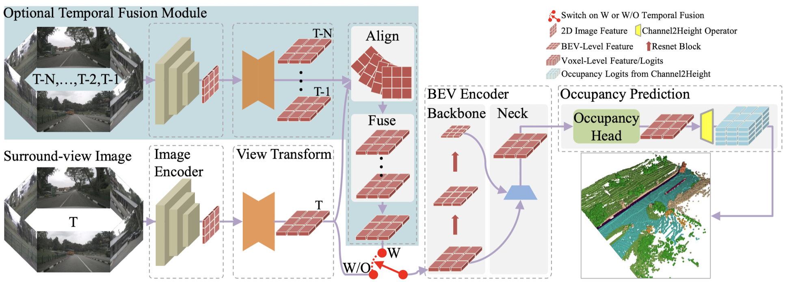
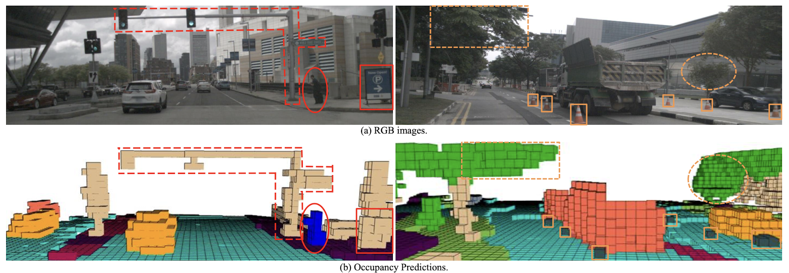
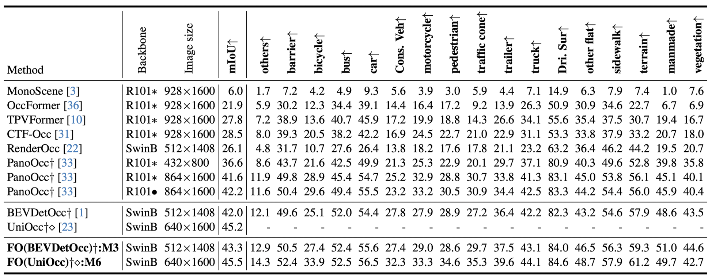

# FlashOcc

## Framework

### Image Encoder

It utilizes a backbone network to extract multi-scale semantic features, which are subsequently fed into a neck module for fusion (eg. ResNet + FPN).

### View Transformer

LSS or LS (Fast-BEV)

### BEV Encoder

Similar to image encoder (backone + neck).

### Occupancy Prediction Module

Occupancy head, it consists of a multi-layer convolutional network. Then passed through the Channel-to-Height module, which consists of linear layers.

### Temporal Fusion Module

It consists of two main components: the spatio-temporal alignment module and the feature fusion module.

## Experiments

