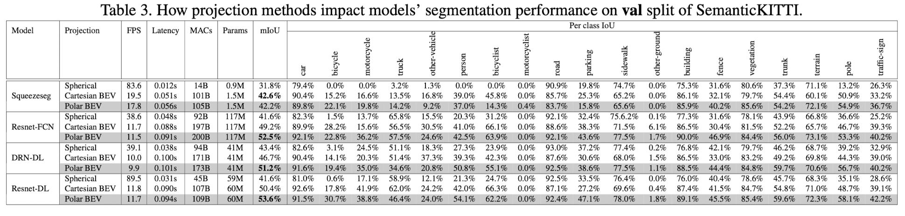

# PolarNet

## Framework

### Bird’s-eye-view Partitioning

Point clouds to 2D top-down image.

The points densely concentrated in the middle grid cells and peripheral grid cells stay totally empty. The minor points’ predictions will be suppressed by the majority in the output since the final prediction is on voxel-level.

### Polar Bird’s-eye-view

Polar partitioning replacing the Cartesian partitioning.

First, it more evenly distributes the points. The second benefit of the polar BEV is that the more balanced point distribution lessens the burden on predictors.

With the Cartesian BEV, on average, 98.75% of points in every grid cell share the same label. And this number jumps to 99.3% in the polar BEV.

### Learning the Polar Grid

Points feature net: PointNet.

Backbone: Ring convolution.

## Experiments

