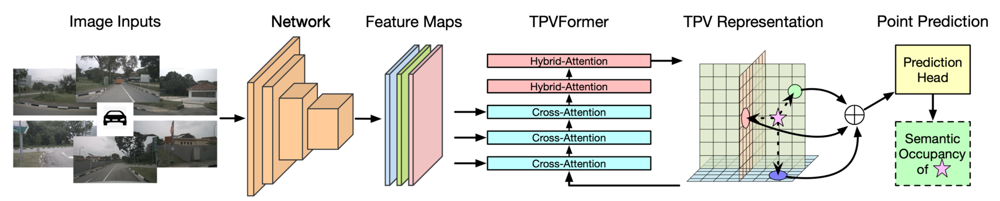
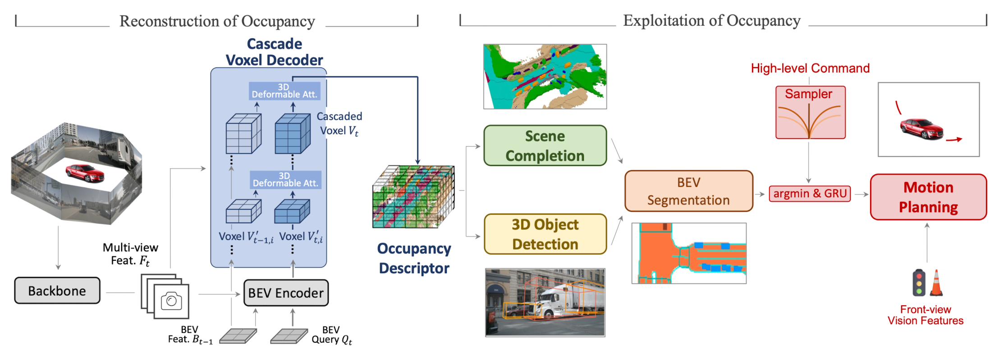
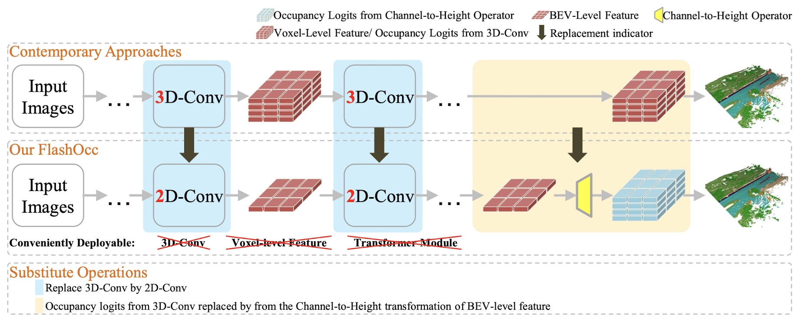
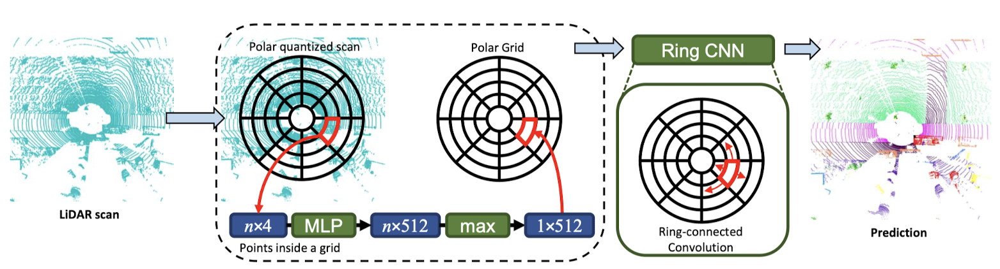
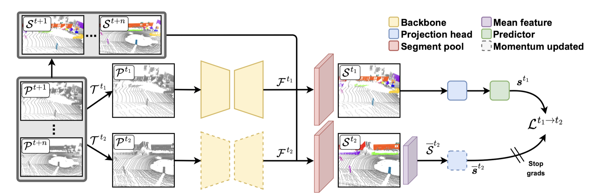

# Autonomous Driving

## Occupancy

### [CVPR 2023] TPVFormer: Tri-Perspective View for Vision-Based 3D Semantic Occupancy Prediction

Yuanhui Huang1,2*, Wenzhao Zheng1,2*, Yunpeng Zhang3, Jie Zhou1,2, Jiwen Lu1,2,†

( 1Beijing National Research Center for Information Science and Technology, China, 2Department of Automation, Tsinghua University, China, 3PhiGent Robotics, *Equal contribution, †Corresponding author )

Vision-based, motivated by MonoScene, generalize BEV by accompanying it with two perpendicular planes to construct three cross-planes perpendicular to each other, can produces consistent semantic voxel occupancy prediction with only sparse point supervision during training. ([Details](./assets/TPVFormer.md))

[[Paper in arXiv](https://arxiv.org/pdf/2302.07817.pdf)] [[Code](https://github.com/wzzheng/TPVFormer)]

### [ICCV 2023] OccNet: Scene as Occupancy

Chonghao Sima1,3∗†, Wenwen Tong2∗, Tai Wang1,4, Li Chen1,3, Silei Wu2, Hanming Deng2, Yi Gu1, Lewei Lu2, Ping Luo3, Dahua Lin1,4, Hongyang Li1

( 1Shanghai AI Laboratory, 2SenseTime Research, 3The University of Hong Kong, 4The Chinese University of Hong Kong, ∗Equal contribution, †Project lead, )

Vision-based, voxel-wise, two-stage framework, obtains robust occupancy features from images and supports multiple driving tasks. ([Details](./assets/OccNet.md))

[[Paper in arXiv](<https://arxiv.org/pdf/2306.02851.pdf>)] [[Code](<https://github.com/OpenDriveLab/OccNet>)]

### [arXiv 2023] FlashOcc: Fast and Memory-Efficient Occupancy Prediction via Channel-to-Height Plugin

Zichen Yu1, Changyong Shu2, Jiajun Deng3, Kangjie Lu2, Zongdai Liu2, Jiangyong Yu2, Dawei Yang2, Hui Li2, Yan Chen2

( 1Dalian University of Technology, 2Houmo AI, 3University of Adelaide )

FlashOcc is a plug-and-play paradigm, to consolidate rapid and memory-efficient occupancy prediction while maintaining high precision. ([Details](./assets/FlashOcc.md))

[[Paper in arXiv](https://arxiv.org/pdf/2311.12058)][[Code](https://github.com/Yzichen/FlashOcc)]

## Semantic Segmentation

### [CVPR 2020] PolarNet: An Improved Grid Representation for Online LiDAR Point Clouds Semantic Segmentation

Yang Zhang∗1, Zixiang Zhou∗1, Philip David2, Xiangyu Yue3, Zerong Xi1, Boqing Gong†1, and Hassan Foroosh1

( 1Department of Computer Science, University of Central Florida, 2Computational and Information Sciences Directorate, U.S. Army Research Laboratory, 3Department of Electrical Engineering and Computer Sciences, University of California, Berkeley, *Contributed equally, †Now at Google )

Lidar-based, birds-eye-view, encoder-decoder framework, obtains 3D semantic segmentation results. Real-time and deployment-friendly. ([Details](./assets/PolarNet.md))

[[Paper in arXiv](https://arxiv.org/pdf/2003.14032)] [[Code](https://github.com/edwardzhou130/PolarSeg)]

### [CVPR 2023] Temporal Consistent 3D LiDAR Representation Learning for Semantic Perception in Autonomous Driving

Lucas Nunes∗, Louis Wiesmann∗, Rodrigo Marcuzzi∗, Xieyuanli Chen∗, Jens Behley∗, Cyrill Stachniss∗,⋆,‡

( ∗University of Bonn, ⋆University of Oxford, ‡Lamarr Institute )

A novel self-supervised pre-training for 3D LiDAR data able to learn a robust and temporally- consistent representation by clustering together points from the same object viewed at different points in time.

[[Paper in CVF](https://openaccess.thecvf.com/content/CVPR2023/papers/Nunes_Temporal_Consistent_3D_LiDAR_Representation_Learning_for_Semantic_Perception_in_CVPR_2023_paper.pdf)] [[Code](https://github.com/PRBonn/TARL)]

### [arXiv 2024] Learning from Spatio-temporal Correlation for Semi-Supervised LiDAR Semantic Segmentation

Seungho Lee1, Hwijeong Lee2, Hyunjung Shim2

( 1Yonsei University, 2KAIST )

[[Paper in arXiv](https://arxiv.org/pdf/2410.06893)]]
