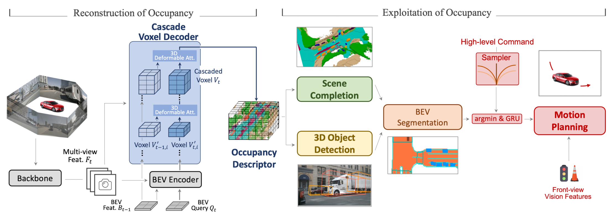
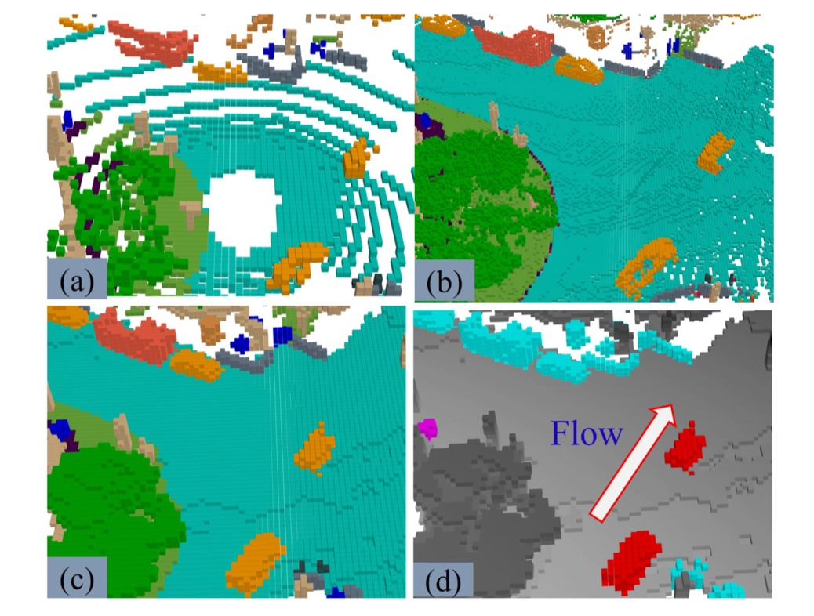
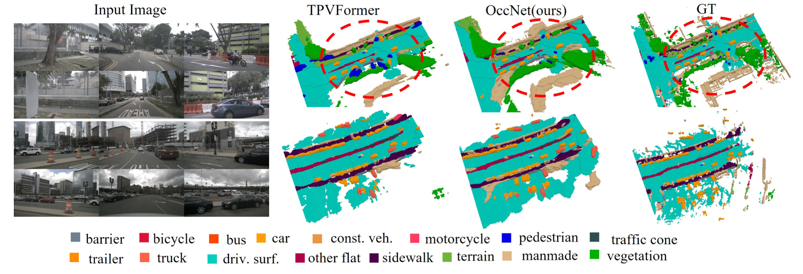

# OccNet

## Two stages

* Reconstruction of Occupancy

    The goal of this stage is to obtain a representative occupancy descriptor for supporting downstream tasks

    First extracts multi-view feature $F_t$ from surrounding images, and feeds them into BEV encoder along with history BEV feature $B_{t−1}$ and current BEV query $Q_t$ to get current BEV feature

    Then, the image feature, the history and current BEV feature are together decoded into occupancy descriptor via Cascade Voxel Decoder

* Exploitation of Occupancy

    Downstream tasks based on the reconstructed occupancy descriptor

### Cascade Voxel Decoder

recover the height information in voxel feature

( why? directly using BEV feature or directly reconstructing voxel feature from perspective view suffers from performance or efficiency drop )

* **From BEV to Cascade Voxel**

    $B_{t−1}$ and $B_t$ are lifted into $V_{t−1,i}$ and $V_{t,i}$ via feed-forward network. Decoder (voxel-based temporal self-attention and voxel-based spatial cross-attention modules) increase height of voxel space, decrease feature dimension

* **Voxel-based Temporal Self-Attention**

    align the history $V'_{t-1,i}$ to the current occupancy features $V_{t,i}$ via the position of ego-vehicle, then calculate 3D Deformable Attention

* **Voxel-based Spatial Cross-Attention**

    the voxel feature $V_{t,i}$ interacts with the multi-scale image features $F_t$ with 2D deformable attention

* **3D Deformable Attention**

    3D-DA in short, each voxel query only needs to interact with local voxels of interest ([Deformable DETR](https://arxiv.org/pdf/2010.04159.pdf))

    $$3D{-}DA(\boldsymbol{q},\boldsymbol{p},V'_{t,i})=\sum_{m=1}^MW_m\sum_{k=1}^KA_{mk}W'_kV'_{t,i}(\boldsymbol{p}+{\Delta}\boldsymbol{p}_{mk})$$

### Exploiting Occupancy on Various Tasks

* **Semantic Scene Completion**

    design the MLP head to predict the semantic label of each voxel, the flow head with $L_1$ loss are attached to estimate the flow velocity per occupied voxels

* **3D Object Detection**

    compact the occupancy descriptor into BEV, then apply a query-based detection head ([BEVFormer](https://arxiv.org/pdf/2203.17270.pdf))

* **BEV segmentation**

    map representation and semantic segmentation are predicted from the BEV feature as in 3D object detection

    drivable-area head and the lane head for map representation, the vehicle segmentation head and the pedestrian segmentation head for semantic segmentation

* **Motion Planning**

    The 3D occupancy results is squeezed along the height dimension and the 3D boxes as well. All the semantic labels per BEV cell from either 3D occupancy or 3D boxes are turned into a 0-1 format

## Benchmark

### OpenOcc

(a) <a href=https://github.com/wzzheng/OpenOcc>TPVFormer</a>
(b) <a href=https://github.com/FANG-MING/occupancy-for-nuscenes>occupancy-for-nuscenes</a>
(c) OccNet
(d) Flow

 

the authour generate occupancy data with dense and high quality occupancy annotations utilizing the sparse LiDAR information and 3D boxes ([nuscenes](https://github.com/nutonomy/nuscenes-devkit)). Moreover, they take the foreground object motion into consideration with additional flow annotation of object voxels

* Independent Accumulation of Background and foreground

* Generation of annotation

    first voxelize the 3D space and label the voxel based on the majority vote of labelled points in the voxel

    annotate the flow velocity of voxel based on the 3D box velocity (threshold $v_{th}$ = 0.2m/s)

### [OpenScene](https://github.com/OpenDriveLab/OpenScene)

a large dataset based on [nuplan](https://github.com/motional/nuplan-devkit)

## Experiments

3D Occupancy prediction

## Conclusion

The OccNet trained on semantic scene completion task can obtain general representation for 3D space owing to the scene reconstructed in the occupancy descriptor.
