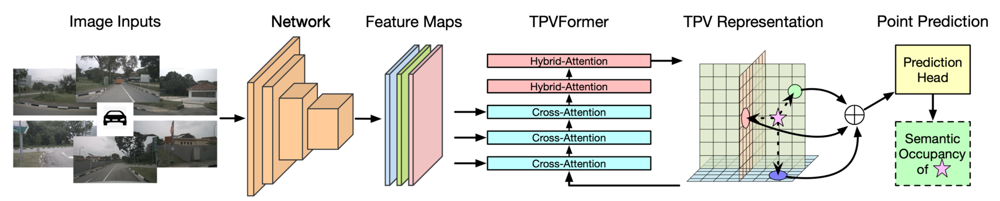

# TPVFormer

## Hybrid explicit-implicit representations Approach

### Generalizing BEV to TPV

three axis-aligned orthogonal TPV planes, may provide complementary clues

* **Point Querying formulation**

* **Voxel feature formulation**

    computation complexity of $O(HW + DH + WD)$, BEV is $O(HW)$, Voxel is $O(HWD)$

    point features along the orthogonal direction of one plane are diversified by features sampled from the other two planes

### TPVFormer

* **Overall Structure**

* **TPVQueries**

* **Image Cross-Attention (ICA)**

* **Cross-View Hybrid-Attention (CVHA)**
