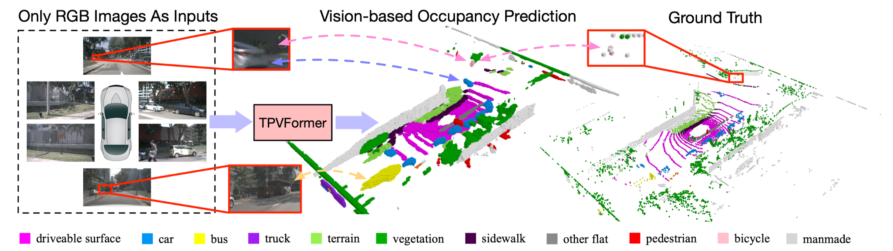
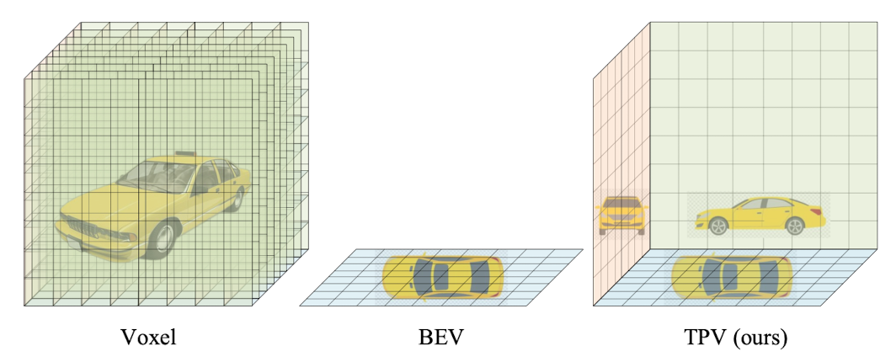
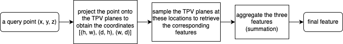
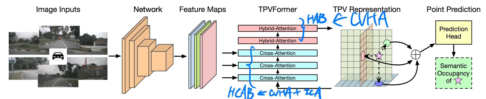

# TPVFormer

## Hybrid explicit-implicit representations Approach

[Efficient Geometry-aware 3D Generative Adversarial Networks](https://arxiv.org/pdf/2112.07945.pdf)

### Generalizing BEV to TPV

three axis-aligned orthogonal TPV planes, may provide complementary clues

* **Point Querying formulation**

* **Voxel feature formulation**

    the TPV planes, when expanded along respective orthogonal directions and summed up, construct a full-scale 3D feature space similar to the voxel feature space

### TPVFormer

* **Overall Structure**

* **TPVQueries**

    TPV query (learnable parameters and add 3D positional embedding) is a grid cell feature belonging to one of the three planes and used to encode view-specific information from the corresponding pillar region.

* **Image Cross-Attention (ICA)**

    for example TPV query located at $(h, w)$

    first calculate its coordinates $(x, y)$ in the top view in the real world

    second sample uniformly $N_{ref}^{HW}$ reference points for the query $\boldsymbol{t}_{h,w}$ along the orthogonal direction of the plane

    third project them into the pixel coordinate

    finally generate offsets and attention weights through two linear layers and updated TPV queries by summing up the sampled image features weighted by their attention weights

    ([Deformable convolution networks](https://arxiv.org/pdf/1703.06211.pdf)) ([Deformable DETR](https://arxiv.org/pdf/2010.04159.pdf))

* **Cross-View Hybrid-Attention (CVHA)**

    exchange their information across different views

## Conclusion
