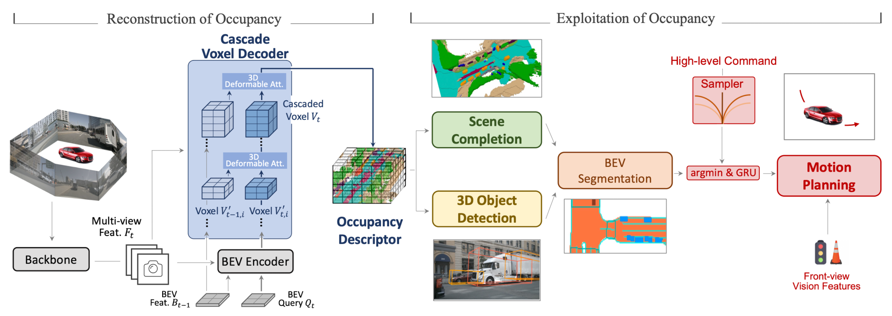

# Paper

My paper reading

# Autonomous Driving

## Occupancy

### [ICCV 2023] OccNet: Scene as Occupancy

Chonghao Sima1,3∗†, Wenwen Tong2∗, Tai Wang1,4, Li Chen1,3, Silei Wu2, Hanming Deng2, Yi Gu1, Lewei Lu2, Ping Luo3, Dahua Lin1,4, Hongyang Li1

( 1 Shanghai AI Laboratory 2 SenseTime Research 3 The University of Hong Kong 4 The Chinese University of Hong Kong ∗Equal contribution †Project lead )

[[Paper in arXiv]](<https://arxiv.org/pdf/2306.02851.pdf>) [[Code]](<https://github.com/OpenDriveLab/OccNet>)
